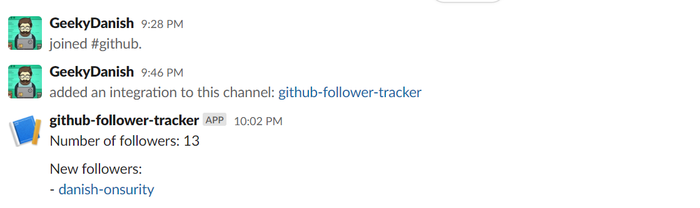

# 🥱 GitHub Followers Tracker

This repo uses GitHub Actions to track a list of my followers on GitHub, and posts updates on Slack. It's largely based on [plibither8/gh-followers-tracker](https://github.com/plibither8/gh-followers-tracker), and runs every minute.

## ⭐ Usage

Required environment variables:

- `GIST_ID` is the ID of a GitHub Gist containing a list of followers
- `GH_TOKEN` is a GitHub personal access token with the `gist` scope
